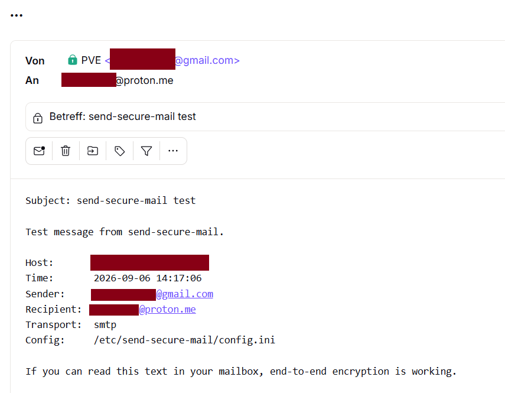

# send-secure-mail

Send logs and messages from a server to any OpenPGP recipient with
**end-to-end encryption** — delivered through Gmail, without Google being
able to read the content.

```
your text / logfile / journalctl
        │  plaintext (never leaves the machine)
        ▼
GnuPG  ── encrypted to the recipient's key ──►  PGP/MIME
        │                                       (multipart/encrypted)
        ▼
sendmail (msmtp) or direct SMTP
        ▼
Gmail  ── sees ciphertext + envelope only ──►  recipient's mailbox
                                               decrypts with their key
```

Encryption happens **before** the message is handed to Gmail. Google only
transports an OpenPGP block.

---

## What Gmail still sees

| Part | Visible to Google |
|---|---|
| Message body, attachments | **no** — ciphertext only |
| Sender, recipient, date, size | yes |
| Subject | **no** — encrypted by default; `--show-subject` puts it in the clear |
| Attachment filenames | no (they live inside the encrypted part) |

Hiding the subject is on by default: the outer header carries a bare `...` and
the real subject travels inside the encrypted part (protected headers, plus the
first line of the body so it stays visible in any client). Clients that
understand protected headers — Proton Mail and Thunderbird among them — show
the real subject once the message is open, marked with a padlock. The
trade-off is the mailbox list, which shows `...` for every such mail. See
[First test](#first-test--hello-world) for what that looks like.

---

## Who can receive these mails

Anyone holding the OpenPGP secret key that matches the public key you encrypt
to. In practice that splits into two groups.

**Providers that decrypt in their own webmail** — nothing for the recipient to
install:

| Provider | How |
|---|---|
| Proton Mail | a key per address, published via WKD; decryption is automatic |
| Mailfence | OpenPGP keystore built into the webmail |
| mailbox.org | *Guard* — OpenPGP in the webmail |
| StartMail | built-in PGP support |
| Hushmail | OpenPGP-based webmail (paid) |
| Disroot, systemli and similar community hosts | Roundcube's *Enigma* plugin, where the host enables it |

**Any mailbox at all** — Gmail, Outlook.com, Fastmail, a work address, your own
server — read with a PGP-capable client:

* Thunderbird (OpenPGP built in since v78), Evolution, KMail, mutt/neomutt, aerc
* [Mailvelope](https://mailvelope.com/) browser extension — decrypts inside the
  Gmail, Outlook.com or Yahoo web interface
* Android: Thunderbird/K-9 Mail or FairEmail together with OpenKeychain
* macOS: Apple Mail with GPG Suite — Windows: Outlook with GpgOL (Gpg4win)

Providers that merely encrypt your mailbox at rest (Posteo's encrypted storage,
for example) still need a PGP client for reading — that feature protects the
stored copy, it does not decrypt anything for you.

The short rule: if you want it readable in a browser with nothing installed,
pick a provider from the first table. If you already read mail in Thunderbird
or on a phone with OpenKeychain, the provider does not matter at all — Gmail
itself would do.

Provider features change, so check before relying on one.

### Getting the recipient's public key

`install.sh` does this for you: when no `.asc` sits next to it, it offers to
look the address up and shows the fingerprint for confirmation. To do it by
hand — note that `--locate-keys` fetches and *imports* the key, printing only a
listing, so the export is a second step:

```bash
# Web Key Directory - works for Proton, mailbox.org and many others
gpg --locate-keys someone@example.org
gpg --armor --export someone@example.org > recipient.asc

# or a keyserver
gpg --keyserver hkps://keys.openpgp.org --search-keys someone@example.org
```

Alternatively export it from the provider (Proton Mail: *Settings → Encryption
and keys → Export*) or just ask the recipient for their `.asc` file. Verify the
fingerprint over a second channel before trusting it.

---

## Requirements

| | Needed |
|---|---|
| Python | 3.7 or newer, standard library only |
| GnuPG | 2.1.14 or newer (for `--recipient-file`) |
| Delivery | an MTA providing `sendmail` (msmtp, Postfix, Exim) **or** nothing at all — the script can speak SMTP itself |
| Installer | `bash`, root, and one of apt / dnf / yum / zypper / pacman / apk (or Homebrew on macOS) |

### Supported systems

* **Linux** — any distribution that ships Python 3 and GnuPG 2.1.14+: Debian and
  Ubuntu (bookworm/jammy and newer), Fedora, RHEL/Alma/Rocky 9+, openSUSE,
  Arch, Alpine. `install.sh` picks the right package manager; the systemd timer
  is optional and skipped where systemd is absent.
* **macOS** — works with `sudo ./install.sh` once `gnupg` is present
  (`brew install gnupg`, plus `brew install msmtp` if you want the sendmail
  path). Homebrew refuses to run as root, so install the packages first, then
  the installer. No systemd — schedule with cron or launchd instead.
* **Windows** — the program itself runs (Python 3 + Gpg4win), but there is no
  installer; see [Windows](#windows) below. Use `transport = smtp`;
  `--journal` needs systemd and is unavailable.

---

## Installing on Linux or macOS

Copy the files to the machine (`send-secure-mail`, `install.sh`, optionally
`systemd/`), put the recipient's exported public key next to them as
`publickey.asc`, and run:

```bash
sudo ./install.sh
```

That is the whole command — the installer asks for everything it needs:

1. Gmail address used as the sender, and a display name
2. the recipient address
3. the public key file — auto-detected if an `*.asc` sits next to the script,
   otherwise it offers to fetch the key for the recipient over WKD or from
   keys.openpgp.org — then shows its fingerprint and user ID for confirmation
4. whether to set up msmtp as `sendmail`, or to speak SMTP directly
5. whether to install the daily systemd timer
6. the Gmail app password (hidden input, entered twice)

It then installs the files, prints a summary, and offers to send an encrypted
test mail right away.

Anything you already know can be passed as an option; only what is missing gets
asked:

```bash
sudo ./install.sh --gmail-user your.name@gmail.com \
                  --recipient you@example.org \
                  --with-msmtp
```

Fully unattended (for configuration management):

```bash
SSM_SMTP_PASSWORD=abcdefghijklmnop sudo -E ./install.sh -y \
    --gmail-user your.name@gmail.com --recipient you@example.org \
    --with-msmtp --no-timer
```

`sudo ./install.sh --help` lists every option.

### What gets installed

| Path | Contents |
|---|---|
| `/usr/local/bin/send-secure-mail` | the program |
| `/etc/send-secure-mail/config.ini` | configuration (no secrets) |
| `/etc/send-secure-mail/recipient.asc` | the recipient's public key |
| `/etc/msmtprc` | Gmail credentials for msmtp, mode `0600` |
| `/etc/send-secure-mail/smtp-password` | app password, mode `0600` (direct-SMTP setup) |

### First test — hello world

The installer offers to do this at the end; you can repeat it any time:

```bash
sudo send-secure-mail --test
```

That sends a fixed diagnostic message naming the host, time, sender, recipient,
transport and config file in use. To send your own text instead — and to make
the mail easy to spot in the inbox list while testing:

```bash
sudo send-secure-mail "hello world"
sudo send-secure-mail --show-subject -s "hello world" "if you can read this, it works"
```

**What should arrive:**



A normal, readable message. Note the two subject lines: the mailbox list shows
`...` — that is all Gmail carried — while the opened message shows the real
subject next to a padlock, which is Proton reading the *protected header* from
inside the encrypted part. The first body line repeats it for clients that do
not render protected headers.

**Proof that Gmail never saw the text:** open the *Sent* folder of the Gmail
account that delivered it and look at the same message — there you see only
`-----BEGIN PGP MESSAGE-----` and a block of base64. Same mail, same moment,
unreadable on Google's side.

**If nothing arrives**, work backwards:

```bash
sudo send-secure-mail --show-key            # is the config the one you think?
sudo send-secure-mail "hello world" --dry-run | head -20   # is a message built?
sudo journalctl -t msmtp -n 20              # what did the MTA say?
```

Also check the recipient's spam folder — a first machine-generated mail from a
fresh Gmail account often lands there once.

---

## The Gmail app password

Google does not accept your account password for SMTP. You need an **app
password**: 16 lowercase letters, tied to one account, revocable on its own.

1. Enable 2-step verification: <https://myaccount.google.com/security>
2. Create the app password: <https://myaccount.google.com/apppasswords>
   — pick app *Mail*, device *Other*, and name it after the machine.
3. Paste it when the installer asks. Spaces are stripped automatically.

If the app-passwords page is empty or missing, 2-step verification is not
active yet on that account.

### How to hand it over — safest first

| Way | When |
|---|---|
| Interactive prompt (`sudo ./install.sh`) | **default and best** — never touches the shell history or the process list |
| `--password-file FILE` | scripted installs; create it with `install -m 600 /dev/null f && cat > f`, then delete it afterwards |
| `SSM_SMTP_PASSWORD=… sudo -E ./install.sh` | configuration management (Ansible `no_log`, CI secret store) |
| On the command line | **never** — visible in `ps` and in your shell history |

`SSM_SMTP_PASSWORD` also works at send time and takes precedence over the
password file, which is handy for a systemd unit using
`LoadCredentialEncrypted=`.

### Keeping it safe afterwards

* The secret lands in `/etc/msmtprc` or `/etc/send-secure-mail/smtp-password`,
  owned by root with mode `0600`. That is the standard practice for unattended
  SMTP, and it is why the sender runs as root.
* **Use a dedicated Gmail account** for this. An app password grants full SMTP
  and IMAP access to the account it belongs to — if the server is compromised,
  you want that blast radius to be a throwaway mailbox, not your personal mail.
* Revoke it in the same Google settings page the moment a machine is retired.
  Revoking one app password does not affect any other.
* Encrypting the password at rest (msmtp's `passwordeval` with a GnuPG file,
  for instance) only helps if the decryption key is *not* on the same machine.
  On an unattended server it usually is, so it obfuscates rather than protects.
  If you want real hardening on a systemd host, use
  `systemd-creds encrypt` plus `LoadCredentialEncrypted=` in the unit, which
  binds the secret to that machine (and its TPM, where available).
* OAuth2 (XOAUTH2) is the alternative to app passwords, but the refresh token
  it stores on disk is just as sensitive, and the setup is far more work. For
  this use case an app password on a dedicated account is the reasonable
  standard.

---

## Verify the fingerprint

The installer prints the fingerprint of the key it is about to use. Compare it
with what the recipient publishes (Proton Mail shows it under *Settings →
Encryption and keys*), and only then confirm.

The fingerprint is written to the configuration, and before every send the
program checks that the key file still matches it exactly — otherwise it aborts
before anything is encrypted or sent. `send-secure-mail --show-key` prints the
active configuration and key at any time.

---

## Usage

Plain text arguments are the **message body**, never the subject. The subject
comes from `-s`, or is generated as `Logs <host> <date>`. The recipient comes
from the configuration that `install.sh` wrote, so `-t` is only needed to send
somewhere else for once.

```bash
# body only - recipient and subject come from the config
send-secure-mail "backup finished at 03:00"

# -s sets the subject; with no text the body is generated from the attachments
send-secure-mail -s "Syslog" --attach /var/log/syslog

# -t overrides the configured recipient for this one mail
send-secure-mail -t someone.else@example.org -s "Syslog" --attach /var/log/syslog

# shorthand: a bare address as the first word is taken as the recipient
send-secure-mail you@example.org "secret text"

# Pipes: anything on stdin becomes the encrypted message body
journalctl -p err -S -1d | send-secure-mail -s "errors today"
dmesg | send-secure-mail --stdin-attach dmesg.log -s "kernel"

# Collect journalctl directly (arrives as a .gz attachment)
send-secure-mail --journal --journal-priority err --journal-since=-7d
send-secure-mail --journal --journal-unit nginx.service -s "nginx"

# Let the subject travel in the clear (readable in the inbox list)
send-secure-mail --show-subject -s "Nightly backup" --attach /var/log/backup.log

# Inspect instead of sending
send-secure-mail "test" --dry-run | less
```

| Option | Effect |
|---|---|
| `-t, --to` | override the recipient |
| `-s, --subject` | subject (encrypted unless `--show-subject`) |
| `-a, --attach FILE` | attachment, repeatable |
| `--stdin-attach NAME` | treat stdin as an attachment instead of body text |
| `--journal…` | collect `journalctl` output (unit, priority, since, boot, lines) |
| `--gzip / --no-gzip` | compress attachments (default: on) |
| `--max-size BYTES` | truncate attachments, keeping the **tail** (default 5 MiB) |
| `--show-subject` | keep the subject in the plaintext header |
| `--transport smtp\|sendmail` | delivery path for this invocation |
| `--dry-run` | print the finished message, send nothing |
| `--sign` | sign as well (requires `sign_key`) |
| `--test` | send a test message |
| `--show-key` | show the active configuration and recipient key |

Pass values starting with `-` using an equals sign: `--journal-since=-2d`.

---

## Configuration

Looked up in this order: `$SEND_SECURE_MAIL_CONFIG`, then
`~/.config/send-secure-mail/config.ini`, then
`/etc/send-secure-mail/config.ini`. Annotated template:
[config.example.ini](config.example.ini).

Every key can be overridden by an environment variable (`recipient` →
`SSM_RECIPIENT`, `transport` → `SSM_TRANSPORT`, …), and the SMTP password
additionally via `SSM_SMTP_PASSWORD`.

### Two delivery paths

* `transport = sendmail` — the message is handed to `/usr/sbin/sendmail`. Set
  up by `--with-msmtp`, and works just as well with an existing Postfix or
  Exim. Where `msmtp-mta` is unavailable, the installer points
  `sendmail_path` at the `msmtp` binary directly.
* `transport = smtp` — the script talks to `smtp.gmail.com:587` with STARTTLS
  itself. No MTA required; the password comes from `smtp_password_file` or
  `SSM_SMTP_PASSWORD`.

---

## Scheduling

**systemd** (installed by `--install-timer`, or by hand):

```bash
sudo cp systemd/send-secure-mail-logs.* /etc/systemd/system/
sudo systemctl daemon-reload
sudo systemctl enable --now send-secure-mail-logs.timer
systemctl list-timers send-secure-mail-logs.timer
```

Sends the last 24 hours of the journal at priority `warning` and above as an
encrypted gzip attachment, daily around 06:00. Adjust the schedule in the
`.timer` file (`OnCalendar=`) and the scope in the `.service` file
(`ExecStart=`).

**cron** (any Unix, as root):

```cron
0 6 * * *  /usr/local/bin/send-secure-mail --quiet --journal --journal-priority warning
```

**macOS** — no journal, so feed it the unified log:

```cron
0 6 * * *  /usr/bin/log show --last 1d --style compact | /usr/local/bin/send-secure-mail --quiet --stdin-attach system.log -s "Daily log"
```

---

## Windows

`install.sh` is Unix-only, but the program itself runs fine:

1. Install [Python 3](https://www.python.org/downloads/) and
   [Gpg4win](https://gpg4win.org/).
2. Put the recipient's `.asc` somewhere readable, e.g.
   `C:\ProgramData\send-secure-mail\recipient.asc`.
3. Create `%USERPROFILE%\.config\send-secure-mail\config.ini` (or point
   `SEND_SECURE_MAIL_CONFIG` at a file) based on
   [config.example.ini](config.example.ini), with:

   ```ini
   transport     = smtp
   gpg_path      = C:/Program Files (x86)/GnuPG/bin/gpg.exe
   recipient_key = C:/ProgramData/send-secure-mail/recipient.asc
   smtp_password_file = C:/ProgramData/send-secure-mail/smtp-password
   ```

4. Send:

   ```powershell
   python send-secure-mail -s "Report" --attach C:\logs\app.log
   Get-EventLog -LogName System -Newest 200 | Out-String | python send-secure-mail -s "Event log"
   ```

Windows has no `0600`, so restrict the password file with NTFS permissions
(`icacls`) instead. `--journal` and `transport = sendmail` do not apply.

---

## Security notes

* **Secrets belong to root.** `/etc/msmtprc` and
  `/etc/send-secure-mail/smtp-password` are mode `0600`, so sending runs as
  root (sudo, root cron, systemd without `User=`). If another service account
  should send, give it read access through a dedicated group rather than
  `chmod 0644`.
* The secret key never touches this machine; it stays with the recipient. The
  machine holds only the public key, so whoever compromises it cannot read past
  mail (they can read future logs before encryption — that is inherent to the
  design).
* Encryption always goes through `gpg --recipient-file` against the verified
  key file: no keyring, no trust database, no risk of accidentally encrypting
  to some other imported key.
* Without `--sign` the mail is not authenticated. To prove origin, create a key
  on the machine (`gpg --quick-gen-key`), put its fingerprint in `sign_key`,
  and give the matching public key to the recipient for verification.
* Attachments are truncated from the front via `--max-size`; with logs the last
  lines are usually the interesting ones. Gmail caps messages at 25 MB, and
  base64 inflates by roughly a third.
* Using a Gmail account as the sender means Google still learns *that* and
  *when* you write to that address. Encryption protects the content, not the
  metadata.

---

## Structure of the generated message

PGP/MIME per RFC 3156, the same shape Thunderbird produces, so every OpenPGP
client understands it:

```
Content-Type: multipart/encrypted; protocol="application/pgp-encrypted"
├── application/pgp-encrypted      "Version: 1"
└── application/octet-stream       -----BEGIN PGP MESSAGE-----
                                    (inside: multipart/mixed with text,
                                     attachments and protected headers)
```

The encrypted part is canonicalized to CRLF before encryption; text is UTF-8
and base64-encoded.

---

## Troubleshooting

| Symptom | Cause / fix |
|---|---|
| `sendmail not found` | install an MTA (`apt install msmtp msmtp-mta`) or set `transport = smtp` |
| `SMTP login failed` | an app password is required, not the Google account password |
| `Fingerprint check failed` | `recipient.asc` does not match `recipient_fingerprint` — fetch the recipient's key again and verify the fingerprint |
| Recipient sees a PGP block instead of text | their client cannot decrypt OpenPGP, or the key does not belong to that mailbox |
| Mail never arrives | check `journalctl -t msmtp`, try `--transport smtp`, use `--dry-run` to inspect the message |
| Timer does nothing | `systemctl status send-secure-mail-logs.service` |
| `GnuPG not found` | install `gnupg`, or set `gpg_path` to the full binary path |
